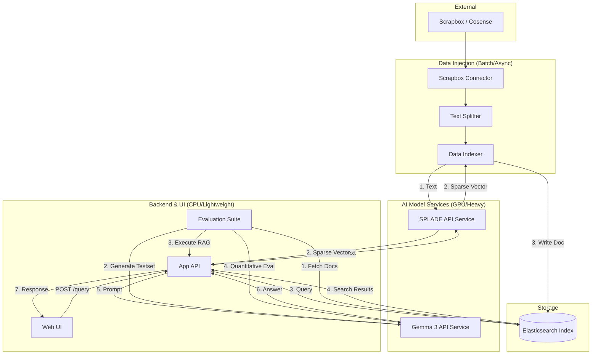

# アーキテクチャ設計案 (RAG Cosense with Local LLM)

## 1. システム概要
Scrapbox (Cosense) のデータをソースとし、SPLADE モデルによる疎ベクトル変換と Elasticsearch を活用したハイブリッド検索（BM25 + 疎ベクトル）による RAG (Retrieval-Augmented Generation) システム。ユーザーの質問に対して、関連する Scrapbox ページを精度高く検索し、LLM が回答を生成する。

## 2. アーキテクチャ構成図

## 3. コンポーネント構成

### 3.1 共通サービス
- **SPLADE API Service**: 
    - テキストを受け取り、SPLADE モデルを用いて疎ベクトル (sparse vector) に変換して返す独立した API サーバー。
- **Gemma 3 API Service**:
    - Gemma 3 モデルを搭載し、プロンプトに基づいてテキスト生成を行う独立した API サーバー (Ollama, vLLM 等を利用)。

### 3.2 データ・インジェクション (バッチ/非同期)
Scrapbox からデータを抽出し、検索エンジンに登録するプロセス。
- **Scrapbox Connector**: Scrapbox API (JSON export など) を介してプロジェクトのデータを取得。
- **Text Splitter**: 
    - 長いページを適切なチャンクサイズに分割。
    - Scrapbox 特有の記法（ブラケットリンクなど）を考慮し、意味的な区切りを壊さないカスタムパーサーを実装。
- **Data Indexer**:
    - 登録処理のメインロジックを担当。
    - `SPLADE API Service` を呼び出してチャンクをベクトル化し、テキスト、メタデータ、ベクトルのセットを `Elasticsearch` に投入する。
- **Elasticsearch Index**:
    - データが格納される永続化レイヤー。

### 3.3 検索 & 回答生成 (オンライン)
ユーザーのリクエストを処理し、回答を生成するプロセス。
- **Web UI**: ユーザーがクエリを入力し、回答を表示するインターフェース。
- **App API**: 
    - ユーザーリクエストの窓口であり、RAG パイプライン全体（検索・生成）を制御する。
    - `SPLADE API` によるクエリのベクトル化、`Elasticsearch` への検索クエリ発行、結果の集約、`Gemma 3 API` への生成依頼を一貫して行う。
- **Augmentor**: `App API` 内で、検索結果とクエリを組み合わせてプロンプトを構築するロジック。
- **Gemma 3 Generator**: 構築されたプロンプトを `Gemma 3 API Service` に送り、回答を取得。
- **Evaluation Suite (RAGAS)**:
    - Ragas フレームワークを用い、回答の忠実性 (Faithfulness) や関連性 (Relevancy) を計測。
    - 合成データ生成ツール (`dataset_generator.py`) と評価実行ツール (`evaluate.py`) で構成。

## 4. データフロー

1.  **データ同期**:
    `Scrapbox API` -> `Text Splitter` -> `Data Indexer` -> `SPLADE API Service` (ベクトル化) -> `Data Indexer` -> `Elasticsearch`
2.  **検索・生成**:
    `User Query` -> `Web UI` -> `App API` -> `SPLADE API Service` (ベクトル化) -> `Elasticsearch` (検索) -> `App API` (プロンプト構築) -> `Gemma 3 API Service` -> `Answer`
3.  **継続的評価**:
    `Elasticsearch` -> `Evaluation Suite` (データ抽出) -> `Gemma 3 API Service` (合成設問生成) -> `App API` (RAG実行) -> `Evaluation Suite` (スコアリング)

## 5. 技術スタック (提案)

| 区分 | 技術 | 備考 |
| :--- | :--- | :--- |
| **Search Engine** | Elasticsearch 8.12.0 | `BM25` + `rank_features` によるハイブリッド検索 |
| **Encoding Service** | SPLADE API (FastAPI) | 独立したサービスとして運用。`/encode` エンドポイントを提供 |
| **LLM Service** | Gemma 3 (Ollama / vLLM) | `/api/generate` を介してストリーミング推論を実行 |
| **Main Application** | App API (FastAPI) | 検索ロジックと RAG フローを制御。`elasticsearch==8.12.0` を使用 |
| **Frontend Framework** | Streamlit | 迅速なプロトタイプ開発 |
| **Language** | Python 3.11+ | 各コンポーネントで一貫した型ヒント、非同期処理を実装 |

## 6. 運用・実装上の注意点

### 6.1 接続の安定性 (macOS/Docker)
- コンテナ間通信には Docker サービス名（`elasticsearch`, `splade-api`）を使用し、ホスト（ブラウザ等）からは `localhost` を使用する。
- macOS 環境では `127.0.0.1` よりも `localhost` の方が通信が安定する場合があるため、デフォルト設定に採用。

### 6.2 データバリデーション
- Elasticsearch の `rank_features` は「0より大きい正の値」のみを受け付ける。
- インデクサー側で SPLADE モデルの出力から負値や 0 をフィルタリングすることで `BulkIndexError` を防止。

### 6.3 依存関係の整合性
- Elasticsearch の Python ライブラリとサーバー本体のバージョン（8.12.0）を厳密に一致させることで、非同期通信とプロトコルの互換性を確保。

## 7. 検討事項・将来の拡張性
- **メタデータフィルタリング**: 特定のタグや日付での絞り込み。
- **Re-ranking**: 検索結果を上位数件に対して Cross-Encoder モデルで再ランク付け。
- **差分同期**: Scrapbox の更新を検知して差分のみを Elasticsearch に反映させる仕組み。

## 7. マイクロサービス化における懸念事項と対策

### 7.1 通信オーバーヘッドとレスポンス遅延
- **懸念**: 1つのリクエストに対して `App API` ⇔ `SPLADE API` ⇔ `ES` ⇔ `Gemma 3 API` と多くのホップが発生し、ネットワーク遅延やシリアライズ負荷が累積する。
- **対策**: 
    - 同一プロジェクト内の場合は gRPC の採用、または SPLADE モデルの App API への統合を検討。
    - 全経路での非同期ストリーミング（TTFT の最小化）を実装。

### 7.2 GPU リソース管理の競合
- **懸念**: `SPLADE` と `Gemma 3` がそれぞれ独立したサービスとして GPU を要求するため、同一ホストで運用する場合に VRAM の食い合いが発生する。
- **対策**: 
    - コンテナレベルでの GPU 割り当て制限（NVIDIA Docker の `shm_size` や `deploy.resources`）の設定。
    - 推論専用サーバー (vLLM 等) のバッチプロセッシング最適化。

### 7.3 可観測性 (Observability) の欠如
- **懸念**: サービスを跨ぐため、プロンプトの構築ミスや検索の失敗、生成の遅延がどのサービスで起きているか追跡が困難になる。
- **対策**: 
    - OpenTelemetry 等を用いた分散トレーシングの導入。
    - 全サービス共通の `Trace-ID` をプロトコルヘッダーに含める。

### 7.4 障害の連鎖 (Cascading Failure)
- **懸念**: `SPLADE API` がダウンすると検索ができず、結果として `Gemma 3` も（コンテキスト不足で）正常な回答ができなくなる。
- **対策**: 
    - タイムアウト設定とサーキットブレーカーの導入。
    - `SPLADE API` 停止時でも Elasticsearch の BM25 検索のみでフォールバックして回答を継続する。

### 7.5 API 間の認証・認可
- **懸念**: 各サービスが独立しているため、内部ネットワーク内での不正アクセスや、意図しないモデルの呼び出しリスクがある。
- **対策**: 
    - mTLS (mutual TLS) または 内部向けのシンプルな API Key 認証の導入。

### 7.6 検索精度の維持と信頼性評価
- **懸念**: システムの変更が検索精度や回答品質に与える影響を客観的に評価できない。
- **対策**: 
    - Hit Rate や MRR などの検索指標のログ収集。
    - LLM による自動評価（Faithfulness, Answer Relevance）をパイプラインに組み込み、継続的に精度をモニタリング。
