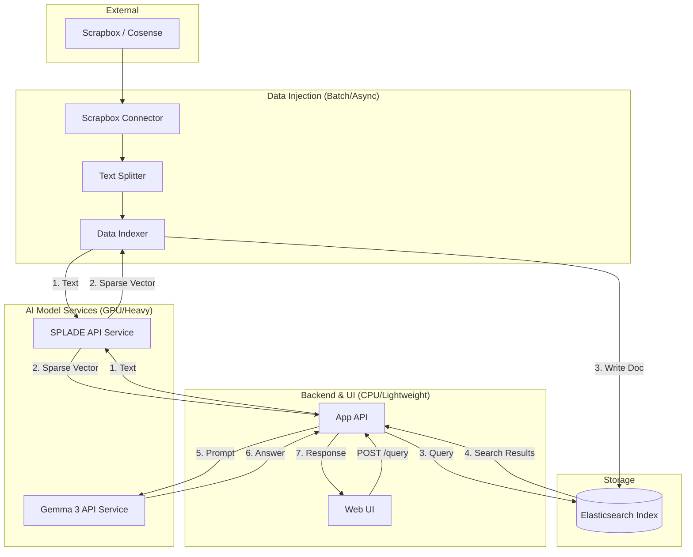

# アーキテクチャ設計案 (RAG Cosense with Local LLM)

## 1. システム概要
Scrapbox (Cosense) のデータをソースとし、SPLADE モデルによる疎ベクトル変換と Elasticsearch を活用した RAG (Retrieval-Augmented Generation) システム。ユーザーの質問に対して、関連する Scrapbox ページを検索し、LLM が回答を生成する。

## 2. アーキテクチャ構成図

## 3. コンポーネント構成

### 3.1 共通サービス
- **SPLADE API Service**: 
    - テキストを受け取り、SPLADE モデルを用いて疎ベクトル (sparse vector) に変換して返す独立した API サーバー。
- **Gemma 3 API Service**:
    - Gemma 3 モデルを搭載し、プロンプトに基づいてテキスト生成を行う独立した API サーバー (Ollama, vLLM 等を利用)。

### 3.2 データ・インジェクション (バッチ/非同期)
Scrapbox からデータを抽出し、検索エンジンに登録するプロセス。
- **Scrapbox Connector**: Scrapbox API (JSON export など) を介してプロジェクトのデータを取得。
- **Text Splitter**: 長いページを適切なチャンクサイズに分割。
- **Data Indexer**:
    - 登録処理のメインロジックを担当。
    - `SPLADE API Service` を呼び出してチャンクをベクトル化し、テキスト、メタデータ、ベクトルのセットを `Elasticsearch` に投入する。
- **Elasticsearch Index**:
    - データが格納される永続化レイヤー。

### 3.3 検索 & 回答生成 (オンライン)
ユーザーのリクエストを処理し、回答を生成するプロセス。
- **Web UI**: ユーザーがクエリを入力し、回答を表示するインターフェース。
- **App API**: 
    - ユーザーリクエストの窓口であり、RAG パイプライン全体（検索・生成）を制御する。
    - `SPLADE API` によるクエリのベクトル化、`Elasticsearch` への検索クエリ発行、結果の集約、`Gemma 3 API` への生成依頼を一貫して行う。
- **Augmentor**: `App API` 内で、検索結果とクエリを組み合わせてプロンプトを構築するロジック。
- **Gemma 3 Generator**: 構築されたプロンプトを `Gemma 3 API Service` に送り、回答を取得。

## 4. データフロー

1.  **データ同期**:
    `Scrapbox API` -> `Text Splitter` -> `Data Indexer` -> `SPLADE API Service` (ベクトル化) -> `Data Indexer` -> `Elasticsearch`
2.  **検索・生成**:
    `User Query` -> `Web UI` -> `App API` -> `SPLADE API Service` (ベクトル化) -> `Elasticsearch` (検索) -> `App API` (プロンプト構築) -> `Gemma 3 API Service` -> `Answer`

## 5. 技術スタック (提案)

| 区分 | 技術 | 備考 |
| :--- | :--- | :--- |
| **Search Engine** | Elasticsearch | `rank_features` による高速な疎ベクトル検索 |
| **Encoding Service** | SPLADE API (FastAPI) | 独立したサービスとして運用。GPUリソースを集中活用 |
| **LLM Service** | Gemma 3 (Ollama / vLLM) | 独立したサービスとして運用。マルチモーダル対応も視野 |
| **Main Application** | App API (FastAPI) | 検索ロジックも含め、 RAG フローを制御 |
| **Frontend Framework** | Streamlit or Next.js | 迅速なプロトタイプ開発 |
| **Language** | Python 3.10+ | エコシステムの活用 |

## 6. 検討事項・将来の拡張性
- **ハイブリッド検索**: BM25 と SPLADE のスコアを組み合わせる (RRF など) ことによる精度向上。
- **メタデータフィルタリング**: 特定のタグや日付での絞り込み。
- **Re-ranking**: 検索結果を上位数件に対して Cross-Encoder モデルで再ランク付け。
- **差分同期**: Scrapbox の更新を検知して差分のみを Elasticsearch に反映させる仕組み。

## 7. マイクロサービス化における懸念事項と対策

### 7.1 通信オーバーヘッドとレスポンス遅延
- **懸念**: 1つのリクエストに対して `App API` ⇔ `SPLADE API` ⇔ `ES` ⇔ `Gemma 3 API` と多くのホップが発生し、ネットワーク遅延やシリアライズ負荷が累積する。
- **対策**: 
    - 同一プロジェクト内の場合は gRPC の採用を検討。
    - Gemma 3 の生成（Streaming）を Web UI まで透過的にストリーミングする設計。

### 7.2 GPU リソース管理の競合
- **懸念**: `SPLADE` と `Gemma 3` がそれぞれ独立したサービスとして GPU を要求するため、同一ホストで運用する場合に VRAM の食い合いが発生する。
- **対策**: 
    - コンテナレベルでの GPU 割り当て制限（NVIDIA Docker の `shm_size` や `deploy.resources`）の設定。
    - 推論専用サーバー (vLLM 等) のバッチプロセッシング最適化。

### 7.3 可観測性 (Observability) の欠如
- **懸念**: サービスを跨ぐため、プロンプトの構築ミスや検索の失敗、生成の遅延がどのサービスで起きているか追跡が困難になる。
- **対策**: 
    - OpenTelemetry 等を用いた分散トレーシングの導入。
    - 全サービス共通の `Trace-ID` をプロトコルヘッダーに含める。

### 7.4 障害の連鎖 (Cascading Failure)
- **懸念**: `SPLADE API` がダウンすると検索ができず、結果として `Gemma 3` も（コンテキスト不足で）正常な回答ができなくなる。
- **対策**: 
    - タイムアウト設定とサーキットブレーカーの導入。
    - `SPLADE API` 停止時でも Elasticsearch の BM25 検索のみでフォールバックして回答を継続する。

### 7.5 API 間の認証・認可
- **懸念**: 各サービスが独立しているため、内部ネットワーク内での不正アクセスや、意図しないモデルの呼び出しリスクがある。
- **対策**: 
    - mTLS (mutual TLS) または 内部向けのシンプルな API Key 認証の導入。
